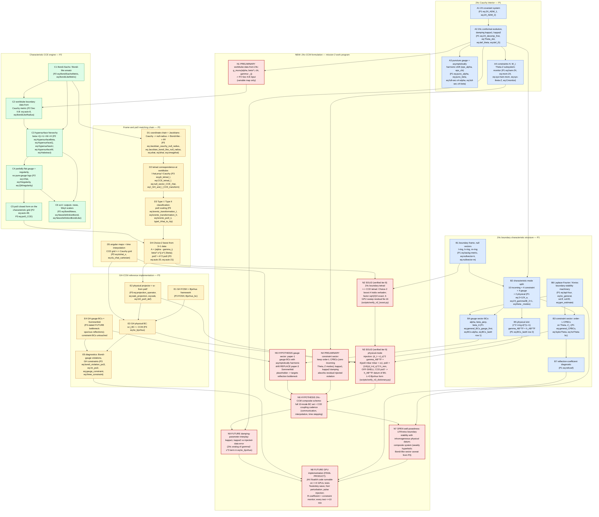

# Z4c-CCM Formulation DAG — synthesis of arXiv:1010.0523v2 + 2007.01339 + 2308.10361

**Goal (mission 2):** a NEW FORMULATION — Cauchy-characteristic matching (CCM) for the
**Z4c** evolution system. Organizing principle (per the mission hint): **physical
degrees of freedom**, **characteristic modes**, and **boundary conditions**.

**Thesis.** At a timelike worldtube boundary, Z4c has exactly ten incoming
characteristic fields, which paper 1 (Ruiz–Hilditch–Bernuzzi 2010) splits into
**4 constraint + 4 gauge + 2 physical** modes and supplies with ten boundary
conditions. Paper 3 (Ma et al. 2023) demonstrates, for the GH system, that CCM
need only act on the **2 physical** incoming modes: CCE's ψ₀, boosted into the
Cauchy frame by a Type-II transformation built purely from 3+1 quantities,
replaces the free physical boundary datum. Paper 2 (Moxon–Scheel–Teukolsky 2020)
provides the characteristic engine (worldtube data → hypersurface hierarchy →
ψ₀) that is agnostic to which Cauchy formulation feeds it. Therefore:

> **Z4c-CCM** = paper-1's boundary-condition set with its **physical slot**
> (the trace-free tangential-metric datum `h_AB^TF` of `eq:BCs_lastII`)
> driven by CCE's ψ₀ through paper-3's Choice-2 boost, while the **constraint
> slot** keeps Z4c CPBCs (`eq:general_CPBCs`) and the **gauge slot** keeps
> paper-1's gauge BCs — which simultaneously attacks paper-3's stated
> bottleneck (Sommerfeld gauge BCs causing spurious reflections).

Status markers follow `phys-agentic-loop/_common/contracts/markers.md`.
Source-grounded nodes cite verbatim equation labels resident in
`knowledge-database/paper_arxiv-<id>/nodes.jsonl` (P1 = 1010.0523v2,
P2 = 2007.01339, P3 = 2308.10361). N-nodes are the new-formulation work
program, mirrored in `knowledge-database/paper_z4c-CCM/nodes.jsonl`.

## The DAG

## Node ledger (source grounding)

Every cited label below is a `node_id` in the corresponding
`knowledge-database/paper_arxiv-<id>/nodes.jsonl` (verified by
`scripts/zccm_dag_check.py`).

| node | paper | source equation labels (verbatim node_ids) | status |
|---|---|---|---|
| A1 | 1010.0523v2 | eq:Z4_ADM_1, eq:Z4_ADM_2 | [SOLID] transcription |
| A2 | 1010.0523v2 | eq:Z4_decomp_first, eq:Theta_dot, eq:def_theta, eq:def_Zi | [SOLID] transcription |
| A3 | 1010.0523v2 | eq:punc_alpha, eq:punc_beta, eq:full-sec-z4-alpha, eq:full-sec-z4-beta | [SOLID] transcription |
| A4 | 1010.0523v2 | eq:ham-Z4, eq:mom-Z4, eq:sys-ham-mom, eq:sys-theta-Z, eq:Cmonitor | [SOLID] transcription |
| B1 | 1010.0523v2 | eq:backg-metric, eq:nullvector-k, eq:nullvector-m | [SOLID] transcription |
| B2 | 1010.0523v2 | eq:2+1Z4_a, eq:Z4_gammaAB_2+1, eq:theta _modes | [SOLID] transcription |
| B3 | 1010.0523v2 | eq:general_CPBCs, eq:fcpbcTheta, eq:hoTheta-bc | [SOLID] transcription |
| B4 | 1010.0523v2 | eq:general_BCs_gauge_first, eq:BCs-alpha, eq:BCs_lastII | [SOLID] transcription |
| B5 | 1010.0523v2 | eq:BCs_lastII | [SOLID] transcription |
| B6 | 1010.0523v2 | eq:lapl-four, eq:bc_general, sol:lf, sol:lf2, eq:gen_estimate | [SOLID] transcription |
| B7 | 1010.0523v2 | eq:refcoef | [SOLID] transcription |
| C1 | 2007.01339 | eq:BondiSachsMetric, eq:BondiLikeMetric | [SOLID] transcription |
| C2 | 2007.01339 | eq:auto-8, eq:BondiLikeRadius | [SOLID] transcription |
| C3 | 2007.01339 | eq:HypersurfaceBeta, eq:HypersurfaceQ, eq:HypersurfaceU, eq:HypersurfaceW, eq:Habstract | [SOLID] transcription |
| C4 | 2007.01339 | eq:UHat, eq:Hregularity, eq:QWregularity | [SOLID] transcription |
| C5 | 2007.01339 + 2308.10361 | eq:auto-48 (P2); eq:psi0_CCE (P3) | [SOLID] transcription |
| C6 | 2007.01339 | eq:BondiNews, eq:NewsDefinitionBondi, eq:NewsDefinitionBondiLike | [SOLID] transcription |
| D1 | 2308.10361 | eq:Jacobian_cauchy_null_radius, eq:Jacobian_bondi_like_null_radius, eq:ahat, eq:bhat, eq:omegahat | [SOLID] transcription |
| D2 | 2308.10361 | eq:gh_tetrad_l, eq:CCE_tetrad_l, eq:null_vector_CCE_rhat, eq:l_GH_and_l_CCE_transform | [SOLID] transcription |
| D3 | 2308.10361 | eq:lorentz_transformation_I, eq:lorentz_transformation_II, eq:lorentz_psi0_ii, typeI_Ahat_to_Ap | [SOLID] transcription |
| D4 | 2308.10361 | eq:auto-20, eq:auto-21 | [SOLID] transcription |
| D5 | 2308.10361 | eq:duhat_x, eq:du_xhat_cartesian | [SOLID] transcription |
| E1 | 2308.10361 | FOSH, Bjorhus_bc | [SOLID] transcription |
| E2 | 2308.10361 | eq:projection_operator, eq:wab_projection, eq:wab, eq:GH_psi0_def | [SOLID] transcription |
| E3 | 2308.10361 | eq:bc_bjorhus | [SOLID] transcription |
| E4 | 2308.10361 | (design statement: gauge BCs stay Sommerfeld — P3 summary/obligations) | [SOLID] transcription |
| E5 | 2308.10361 | eq:bondi_violation_psi3, eq:im_psi2, eq:gauge_constraint, eq:three_constraint | [SOLID] transcription |
| N1 | z4c-CCM | new; consumes A2 variables, feeds C2 | [PRELIMINARY] |
| N2 | z4c-CCM | new; reuse of D4 with B1 frame; verifier scripts/verify_n2_boost.py → results/numerical/n2_boost_check.txt | [SOLID] verified |
| N3 | z4c-CCM | new; E2/E3 pattern into B5 slot; verifier scripts/verify_n3_dictionary.py → results/numerical/n3_dictionary_check.txt | [SOLID] verified |
| N4 | z4c-CCM | new; B3 + A4 reuse argument | [PRELIMINARY] |
| N5 | z4c-CCM | new; B4 replacing E4 | [HYPOTHESIS] |
| N6 | z4c-CCM | new; composite of N3, N4, N5 + D5 | [HYPOTHESIS] |
| N7 | z4c-CCM | new; B6 machinery, inhomogeneous data | [FUTURE] (analysis obligation) |
| N8 | z4c-CCM | new; P3 test suite + B7/E5/A4 diagnostics | [FUTURE] |
| N9 | z4c-CCM | new; A2 damping vs injected error | [FUTURE] |

## Why this formulation is new (delta over each paper)

1. **vs paper 1 (Z4c CPBC):** the physical datum `h_AB^TF` is no longer a local
   radiation-controlling guess (freezing-ψ₀ / hierarchical absorbing): it is the
   *actual* exterior solution's ψ₀ computed by CCE on the matched characteristic
   domain. Paper 1's boundary becomes transparent to nonlinear backscatter.
2. **vs paper 3 (GH-CCM):** the Cauchy formulation is Z4c (puncture-gauge NR
   codes: BAM/Einstein Toolkit lineage) instead of GH/SpECTRE, and both
   non-physical sectors improve: constraint sector gets Z4c's *damped*,
   light-speed constraint propagation with order-L CPBCs (vs untouched GH
   constraint BCs), and the gauge sector gets paper-1's well-posedness-analyzed
   gauge BCs (vs Sommerfeld — paper 3's own stated source of spurious
   reflections and its declared future work).
3. **vs paper 2 (CCE):** unchanged as an engine, but its worldtube input is now
   sourced from Z4c variables (N1) and its ψ₀ output is consumed at finite
   radius (via D4/N2) rather than only at scri+.

## Standing risks / obligations carried into the work program

- `[N7]` Composite well-posedness: paper 3 records the Bondi-like characteristic
  system as only weakly hyperbolic — CCM inherits this; paper 1's estimates are
  frozen-coefficient and (beyond the constraint subsystem) spherical-reduction
  only. The N7 analysis must state exactly what is and is not proven.
- `[N3]` Mode normalization: the identification of paper-1's incoming
  γ_AB^TF characteristic with w⁻ = 2(ψ₀′ m̄m̄ + ψ̄₀′ mm) needs an explicit
  second-order ↔ first-order dictionary (paper 1 is second order in space,
  paper 3's Bjørhus acts on FOSH fields); speeds and tetrad normalizations must
  be reconciled on the SAME background frame (B1).
- `[N2]` Paper-3's boost uses the characteristic β̂ on the worldtube; in the Z4c
  setup β̂ comes from C2/C3 with N1-supplied data — circular-dependency check
  needed at the initialization step (paper 3 resolves this for GH; verify order
  of operations survives the swap).
- `[N4]` CPBC compatibility: injected physical data must not source incoming
  constraint characteristics at corners/edges of the boundary (paper 1 discards
  tangential terms in 3D — its own flagged instability caveat).

## Verifier

`python3 scripts/zccm_dag_check.py` — checks (a) the mermaid graph above is
acyclic and every edge references a declared node; (b) every source label in
the node ledger exists as a `node_id` in the named paper's knowledge ledger;
(c) every N-node has a row in `knowledge-database/paper_z4c-CCM/nodes.jsonl`
whose status matches the ledger table. Output: `results/numerical/zccm_dag_check.txt`.
